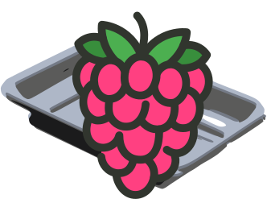

<h1 align="center">Pi-Tray Client</h1>
<p align="center">
    
</p>

---

## Setup notes (TODO improve)

1. Clone the repository:
   ```bash
   git clone https://github.com/Pi-Tray/client.git pi-tray-client
   cd pi-tray-client
   ```
2. Setup [pi-tray-server](https://github.com/Pi-Tray/server) on the PC you want to control.
3. Copy `.env.template` to `.env` and fill in the WebSocket URL of the server.
4. Run `npm install` to install dependencies.
5. Run `npm run build-relative` to build the project for local files to store on the Pi. Use `npm run build-serve` if you want to serve the files over a web server (e.g., nginx, Apache, etc.). The built files will be in the `dist` directory.
6. Put the built files on the Pi (or serve over the network if easier)
7. Optionally create a new user for Pi-Tray: `sudo adduser pi-tray` `sudo usermod -G video pi-tray`
8. Login as the user and create a new autostart file: `nano ~/.config/autostart/pi-tray.desktop`
9. Add the following content to the file, replacing `path/to/your/index.html` with the actual path to your built HTML file (or server URL):
    ```ini
    [Desktop Entry]
    Type=Application
    Name=Pi-Tray
    Exec=chromium-browser --kiosk --allow-file-access-from-files path/to/your/dist/index.html
    Icon=chromium-browser
    Terminal=false
    ```
    You can omit the `--allow-file-access-from-files` flag if you are serving the files instead of loading them from the local filesystem.

    Save the file and exit the editor. When you next log in as the user, Pi-Tray should automatically start in kiosk mode.
 
10. Optionally make the pi-tray user auto-login by editing the `/etc/lightdm/lightdm.conf` file (need sudo permission). Scroll down to the `[Seat:*]` section and change the `autologin-user` line to:
     ```ini
     autologin-user=pi-tray
     ```
     Save the file and exit the editor. Now, when you boot the Pi, it should automatically log in as the `pi-tray` user and start Pi-Tray in kiosk mode.
